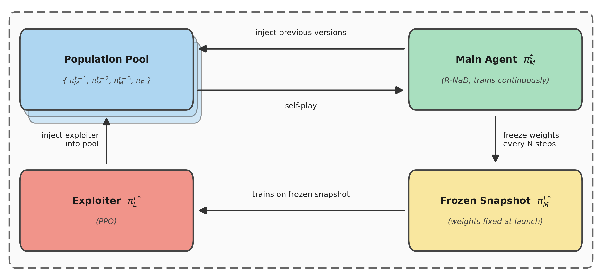
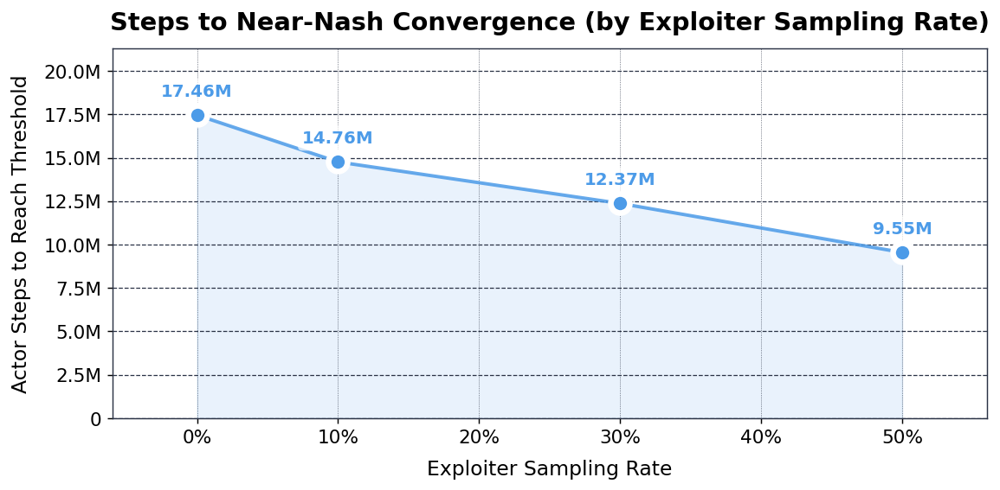
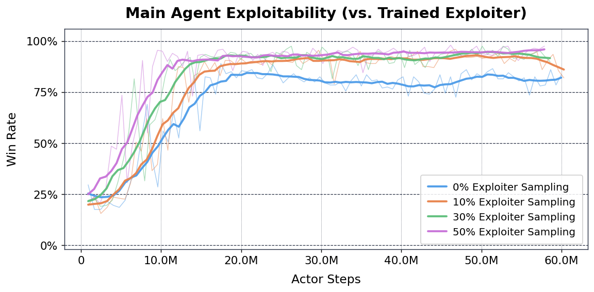
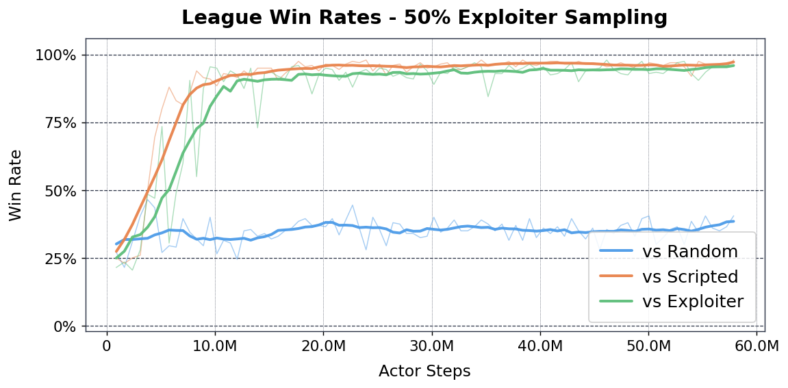
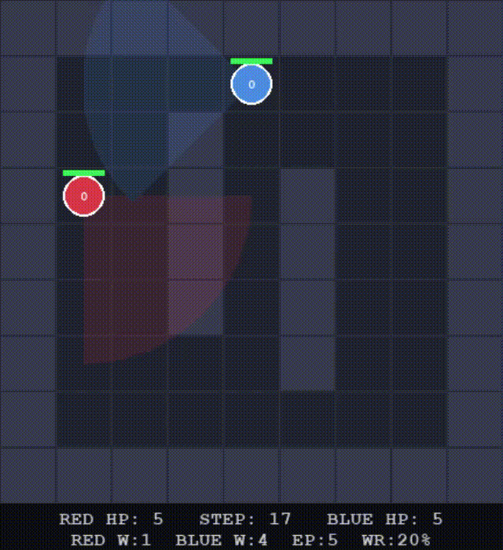
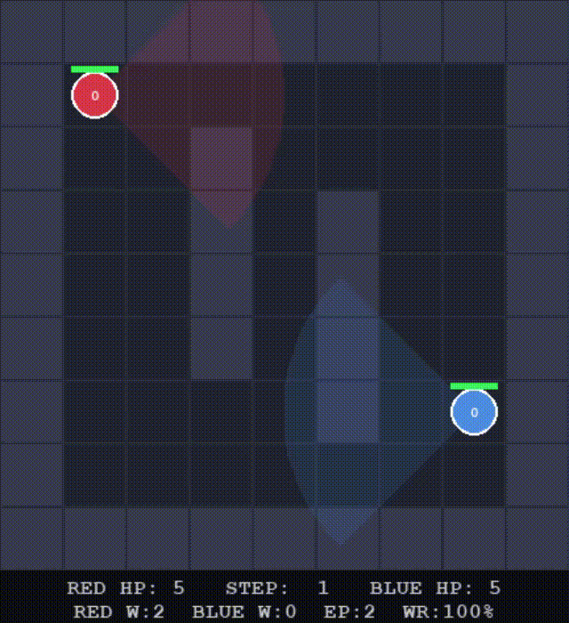
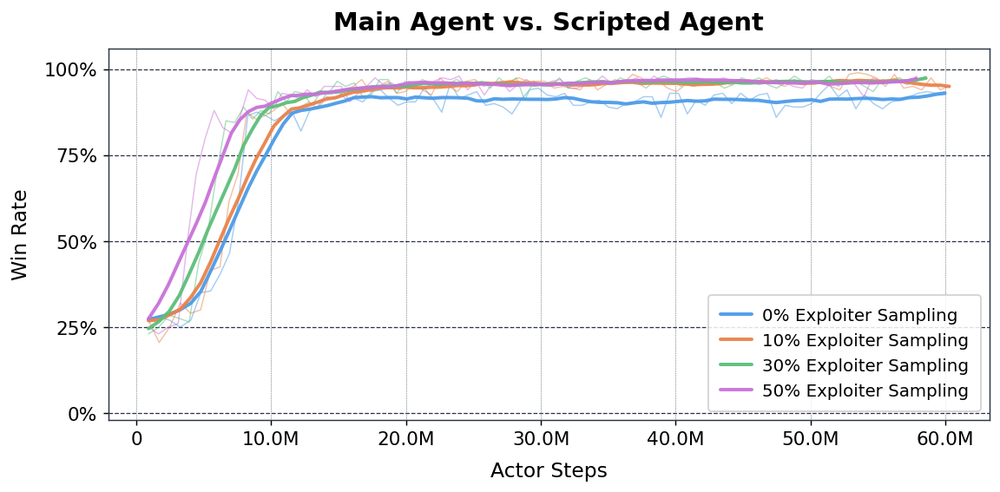
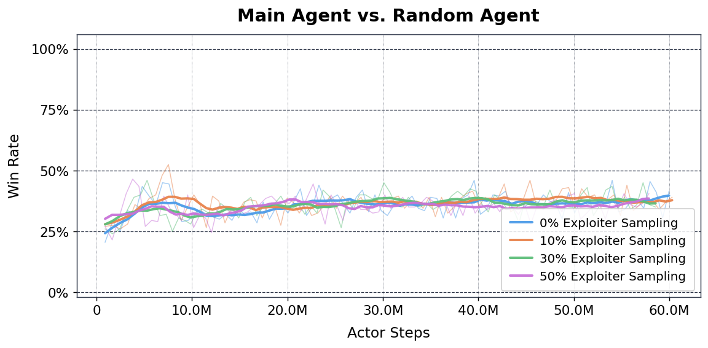

# Fast Nash Equilibrium via Adversarial Training

Accelerating Nash Convergence in Competitive Self-Play via Minimax Exploiter-Augmented R-NaD

A research project exploring adversarial multi-agent reinforcement learning in a custom 2D tactical shooter environment. Three training regimes are implemented: **PPO** (Proximal Policy Optimization via [Stable Baselines 3](https://stable-baselines3.readthedocs.io/)) for single-team training against a fixed opponent, **R-NaD** (Regularized Nash Dynamics) for self-play convergence to a Nash equilibrium, and **Minimax Exploiter / League Training** for iterative adversarial improvement.

---

## Table of Contents

- [Environment](#environment)
- [Algorithms](#algorithms)
- [Results](#results)
- [Project Structure](#project-structure)
- [Setup](#setup)
- [Training](#training)
- [Visualisation](#visualisation)

---

## Environment

### ShooterEnvironment (`environments/shooter_env.py`)

A symmetric N-vs-N tactical shooter built on [PettingZoo](https://pettingzoo.farama.org/) `ParallelEnv`. Two teams (Red and Blue) spawn on opposite corners of a 9×9 grid and fight until one team is eliminated or the step limit is reached.

**Default configuration:** 1 agent per team (1v1).

#### Actions — `Discrete(7)`

| ID | Action               |
| -- | -------------------- |
| 0  | Stay                 |
| 1  | Move North           |
| 2  | Move South           |
| 3  | Move West            |
| 4  | Move East            |
| 5  | Rotate left (−45°) |
| 6  | Rotate right (+45°) |

Moving into a wall cell is silently blocked (the action is consumed but position is unchanged).

#### Vision & Shooting

Each agent has a **90° vision cone** (±45° from heading) with a **3-cell range**. Walls block both vision and line-of-sight. When an enemy is inside the cone and has clear line-of-sight, the agent shoots with **100% hit probability** each step.

#### HP & Elimination

Each agent starts with **5 HP**. When HP reaches 0 the agent is eliminated. The episode ends when all agents on one side are dead or the step limit (200) is reached.

#### Rewards

| Event                       | Reward |
| --------------------------- | ------ |
| Per step                    | −0.05 |
| Hit on enemy                | +2.0   |
| Enemy team eliminated (win) | +20.0  |
| Own team eliminated (loss)  | −20.0 |

#### Observation — `Box(0, 1, shape=(11,))`

A flat float32 vector from the perspective of the observing agent (for the default 1v1 configuration):

| Features               | Dim          | Description                                             |
| ---------------------- | ------------ | ------------------------------------------------------- |
| `norm_x`, `norm_y` | 2×2 = 4     | Normalised grid positions (0–1) for self and enemy     |
| `hp_ratio`           | 2            | HP / 5 for self and enemy                               |
| `in_my_cone`         | 1            | 1 if enemy is currently inside this agent's vision cone |
| `heading (sin, cos)` | 2×2 = 4     | Unit-vector heading for self and enemy                  |
| **Total**        | **11** |                                                         |

#### Rendering

Pass `render_mode="human"` to open a Pygame window. The renderer shows agent positions, HP bars, vision cones, and a step/HP HUD.

---

### ShooterGymEnv (`environments/shooter_gym_env.py`)

A `gymnasium.Env` wrapper around `ShooterEnvironment` that makes it compatible with both **PPO** (single-agent) and **R-NaD** (self-play). Controlled via the `self_play` constructor argument.

#### Self-play mode (`self_play=True`) — for R-NaD

Converts the simultaneous PettingZoo game into a sequential two-player interface. Turns alternate: player 0 (Red) → player 1 (Blue) → …

- **Player 0's turn:** Red's action is buffered; the underlying env does not step yet. Returns Blue's current observation and `reward = [0, 0]`.
- **Player 1's turn:** Both buffered actions are applied; the env steps. Returns Red's new observation and `reward = [r_red, r_blue]`.

V-trace in R-NaD handles the one-turn delay by accumulating discounted returns between a player's own turns.

Extra methods for R-NaD:

- `current_player() → int` — 0 (Red) or 1 (Blue)
- `legal_actions_mask() → np.ndarray` — all-ones (all actions are always legal)

#### Single-agent mode (`self_play=False`) — for PPO / SB3

The agent controls Red; Blue is driven by an `opponent` policy. `step()` returns a scalar float reward for Red.

| `opponent`           | Behaviour                                  |
| ---------------------- | ------------------------------------------ |
| `"random"` (default) | Blue samples uniformly                     |
| `"scripted"`         | Blue uses the BFS `ScriptedShooterAgent` |
| `callable`           | Any `fn(obs: np.ndarray) -> int`         |

#### Constructor arguments

| Argument        | Type               | Default      | Description                            |
| --------------- | ------------------ | ------------ | -------------------------------------- |
| `self_play`   | `bool`           | `True`     | Mode selector                          |
| `opponent`    | `str \| callable` | `"random"` | Blue policy (single-agent mode only)   |
| `render_mode` | `str \| None`     | `None`     | `"human"` to enable Pygame rendering |
| `fps`         | `int`            | `10`       | Frames per second when rendering       |

---

## Algorithms

### PPO (`train.py ppo`)

**Proximal Policy Optimization** via [Stable Baselines 3](https://stable-baselines3.readthedocs.io/). Red is trained as a single agent against a fixed opponent (scripted BFS or random) using `ShooterGymEnv` with `self_play=False`.

| Hyperparameter             | Value          |
| -------------------------- | -------------- |
| Learning rate              | 3e-4           |
| Discount γ                | 0.99           |
| GAE λ                     | 0.95           |
| PPO clip ε                | 0.2            |
| Entropy coefficient        | 0.01           |
| Value function coefficient | 0.5            |
| Batch size                 | 64             |
| Update epochs              | 10             |
| Rollout steps per env      | 2048           |
| Network                    | MLP [256, 256] |

SB3 handles rollout collection, GAE computation, mini-batch updates, and TensorBoard logging automatically. An `EvalCallback` saves the best checkpoint and a `CheckpointCallback` saves periodic snapshots.

---

### R-NaD (`rnad.py`)

**Regularized Nash Dynamics** ([Perolat et al., 2022](https://arxiv.org/pdf/2206.15378.pdf)) — an algorithm that provably converges to a Nash equilibrium in two-player zero-sum games via self-play.

Key ideas:

- A **single shared policy network** is used for both players. The observation is always from the current player's perspective, so the same weights implement a strategy that is optimal regardless of which side you play.
- **V-trace** importance-weighted returns handle the off-policy correction introduced by the sequential wrapper.
- **NeuRD (NERD)** policy updates use a clipped advantage signal with a threshold to avoid large policy deviations.
- An **entropy schedule** (α) interpolates between two regularisation reference policies (`params_prev` and `params_prev_`), gradually tightening the constraint as training progresses.
- A slowly-updated **target network** (EMA, τ = 0.001) provides stable value targets.

#### Network architecture

```
obs (11) → Linear(256) → ReLU → Linear(256) → ReLU
                                               ├─ policy_head → Linear(7)  → masked softmax → π
                                               └─ value_head  → Linear(1)  → V
```

#### Key `RNaDConfig` parameters

| Parameter                    | Default        | Description                                |
| ---------------------------- | -------------- | ------------------------------------------ |
| `policy_network_layers`    | `(256, 256)` | Hidden layer widths                        |
| `batch_size`               | 256            | Parallel environment instances             |
| `trajectory_max`           | 200            | Steps per trajectory (match `MAX_STEPS`) |
| `learning_rate`            | 5e-5           | Adam learning rate                         |
| `target_network_avg`       | 0.001          | EMA rate τ for target network             |
| `entropy_schedule_size`    | `(20000,)`   | Steps per entropy phase                    |
| `entropy_schedule_repeats` | `(1,)`       | Repetitions of each phase                  |
| `eta_reward_transform`     | 0.2            | Entropy regularisation strength            |
| `nerd.beta`                | 2.0            | NeuRD gradient clipping threshold          |
| `c_vtrace`                 | 1.0            | V-trace importance weight clipping         |
| `num_players`              | 2              | Players (set to 1 for single-agent)        |
| `seed`                     | 42             | RNG seed                                   |

#### SB3-style API

```python
model = RNaD(env_fn=lambda: ShooterGymEnv(self_play=True), config=cfg)
model.learn(total_timesteps=500_000)
action, _ = model.predict(obs, legal_actions=mask)
model.save("model.pt")
model = RNaD.load("model.pt", env_fn=env_fn)
```

---

### Minimax Exploiter (`minimax_exploiter.py`)

Based on [Bairamian et al., AAMAS 2024](https://arxiv.org/abs/2311.17190). Augments the exploiter's reward with the *negative* value estimate of the frozen main agent, steering it toward states the main agent considers bad for itself:

```
R_minimax = R_env  -  alpha * gamma * (1 - done) * V_main(s'_blue)
```

The **main agent** is trained with R-NaD (self-play Nash equilibrium). The **exploiter** is trained with PPO against the frozen main agent, which is a better fit for the single-agent exploitation problem.

Two modes:

```bash
# League: RNaD main agent alternates with PPO exploiter
python minimax_exploiter.py league --total-main-steps 500_000

# Train a single PPO exploiter against a saved RNaD checkpoint
python minimax_exploiter.py exploiter --main-checkpoint runs/rnad_main/best_model.pt

# Train a single PPO exploiter against a saved PPO checkpoint
python minimax_exploiter.py exploiter --main-checkpoint runs/ppo_main/best_model.zip
```

Key hyperparameters (`--alpha`, `--gamma`, `--v-shift`) control the minimax reward signal. The exploiter uses all standard PPO arguments (`--n-envs`, `--n-steps`, `--ppo-batch-size`, etc.).

---

### Multiprocess League Training (`league_training.py`)

A concurrent variant where the R-NaD main agent and PPO exploiter train **simultaneously** in separate processes:



The **population** is a rolling window of past RNaD snapshots (default: last 3) plus the latest trained exploiter. RNaD trains against this mixed population, with configurable sampling weights (default: 70% RNaD snapshots, 30% exploiter). The exploiter is retrained approximately every 100k main-agent actor steps.

```bash
python league_training.py --total-main-steps 2_000_000

# Increase exploiter pressure
python league_training.py --exploiter-weight 0.4 --rnad-weight 0.6

# Population self-play only (no exploiter): RNaD trains against past snapshots of itself
python league_training.py --exploiter-interval 999999999

# Exploiter for evaluation only: trains periodically to measure exploitability, but is NOT
# injected into the population — RNaD trains against past snapshots only
python league_training.py --no-exploiter-feedback

# Quick smoke test
python league_training.py --total-main-steps 50_000 \
    --exploiter-interval 10000 --exploiter-max-steps 5000
```

The exploiter win-rate over generations is the primary **Nash convergence proxy** — lower win-rate means the main agent is harder to exploit.

---

### Scripted Agent (`environments/scripted_shooter_agent.py`)

A deterministic rule-based opponent used as a training baseline for PPO. It uses **BFS pathfinding** to navigate toward the nearest living enemy and rotates to face the target when within 3 cells.

---

## Results

All experiments use the multiprocess league setup (`league_training.py`) with a Minimax Exploiter trained periodically against a frozen RNaD snapshot. The exploiter win-rate is the primary Nash convergence proxy — a lower win-rate means the main agent is harder to exploit.

### Exploiter Sampling Rate vs. Convergence Speed

Higher exploiter sampling consistently accelerates convergence. Each curve represents how quickly the main agent reaches an 80% win-rate threshold against a freshly-trained exploiter.



At 50% exploiter sampling the agent reaches the threshold in **9.55M** actor steps — nearly half the **17.46M** steps required with no exploiter in the population. The relationship is monotonically decreasing across all tested sampling rates (0%, 10%, 30%, 50%).

### Main Agent Exploitability Over Training

Win rate of a trained exploiter against the main agent, shown for each exploiter sampling condition. Lower final win-rate = more robust (less exploitable) policy.



All conditions converge to a similarly low exploitability at the end of training, but higher exploiter sampling reaches that regime significantly faster. The 0% condition (vanilla RNaD with no exploiter in the population) is the slowest and most exploitable throughout early training.

### League Win Rates — 50% Exploiter Sampling

Win rates of the main agent against three opponent types throughout a full training run at 50% exploiter sampling.



- **vs Scripted / vs Exploiter (~95%):** The agent quickly learns to dominate both the scripted BFS opponent and the trained exploiter, stabilising above 90% by ~10M steps.
- **vs Random (~35%):** The plateau against a random opponent reflects step-limit timeouts rather than exploitability. The optimal strategy converges to **corner camping** — a corner combined with a 90° vision cone is geometrically unbeatable, so the random agent rarely eliminates the main agent but also rarely walks into its cone before the episode ends.

### Qualitative Examples

In both clips below, **Red = main agent (R-NaD)**, **Blue = trained exploiter (PPO)**, both from the **50% exploiter sampling** run. The exploiter is given full training budget against a frozen snapshot of the main agent at that generation.

<table width="100%">
<tr>
<td align="center" width="50%"></td>
<td align="center" width="50%"></td>
</tr>
<tr>
<td align="center" width="50%"><strong>Generation 5 — exploitable.</strong> The main agent has not yet found a robust strategy; the exploiter (Blue) reliably wins by exploiting predictable movement.</td>
<td align="center" width="50%"><strong>Generation 200 — near-Nash.</strong> The main agent has converged to a corner-camping strategy that the exploiter cannot break: the 90° vision cone makes the corner geometrically unbeatable.</td>
</tr>
</table>

### Win Rates by Opponent Type — All Conditions

<table>
<tr>
<td></td>
<td></td>
</tr>
<tr>
<td align="center"><em>vs Scripted opponent</em></td>
<td align="center"><em>vs Random opponent</em></td>
</tr>
</table>

Higher exploiter sampling also accelerates win-rate gains against the scripted opponent. The ~35% ceiling against random is consistent across all exploiter sampling conditions, confirming it is an environment artefact (corner strategy + step limit) rather than a training signal.

---

## Project Structure

```
adversarial_learning_project/
│
├── rnad.py                          # R-NaD algorithm (SB3-compatible)
├── train.py                         # Unified training script (PPO + R-NaD)
├── minimax_exploiter.py             # Minimax Exploiter (sequential league)
├── league_training.py               # Multiprocess league training
├── animate.py                       # Visualise trained PPO or R-NaD models
├── evaluate_checkpoints.py          # Batch-evaluate all checkpoints in a run folder
│
├── environments/
│   ├── shooter_env.py               # Core PettingZoo environment
│   ├── shooter_gym_env.py           # Gymnasium wrapper (SB3 PPO + R-NaD)
│   ├── scripted_shooter_agent.py    # Rule-based BFS opponent
│   └── utils.py                     # BFS pathfinder, helpers
│
├── plotting/
│   ├── plot_winrate.py              # Win-rate curves for a single run
│   ├── plot_winrates_combined.py    # Overlay win-rate curves across multiple runs
│   ├── plot_exploiter_curves.py     # Exploiter win-rate per generation
│   ├── plot_steps_to_threshold.py   # Steps-to-threshold bar chart by sampling rate
│   ├── reward_loss_over_time.py     # Training reward/loss curves
│   └── render_diagram.py            # Architecture diagram renderer
│
├── test/                            # PettingZoo API validation tests
│
├── runs/                            # Training outputs (gitignored)
├── requirements.txt
└── .gitignore
```

---

## Setup

### 1. Create and activate a Conda environment

```bash
conda create -n adversarial python=3.11
conda activate adversarial
```

### 2. Install PyTorch with GPU support

```bash
# CUDA 11.8
conda install pytorch torchvision torchaudio pytorch-cuda=11.8 -c pytorch -c nvidia

# CPU only
pip install torch torchvision torchaudio --index-url https://download.pytorch.org/whl/cpu
```

### 3. Install remaining dependencies

```bash
pip install -r requirements.txt
```

`requirements.txt` includes: `pygame`, `numpy`, `pettingzoo`, `pymunk`, `SuperSuit`, `tensorboard`, `tqdm`, `matplotlib`, `gymnasium`, `stable-baselines3`.

---

## Training

```bash
tensorboard --logdir runs/   # monitor any run
```

### R-NaD self-play — `python train.py rnad`

Trains a single shared policy to Nash equilibrium via self-play. Both Red and Blue are driven by the same network.

```bash
# Minimal — 500k actor steps
python train.py rnad

# Named run on GPU
python train.py rnad \
    --run-name experiment_1 \
    --total-steps 2_000_000 \
    --batch-size 256 \
    --learning-rate 5e-5 \
    --device cuda
```

#### All arguments — `rnad`

**Common**

| Argument            | Default     | Description                                      |
| ------------------- | ----------- | ------------------------------------------------ |
| `--run-name`      | auto        | Base name;`rnad_` + timestamp appended         |
| `--runs-dir`      | `runs`    | Root directory for outputs                       |
| `--total-steps`   | 500 000     | Stop after this many actor steps                 |
| `--eval-episodes` | 20          | Episodes per evaluation round                    |
| `--hidden-layers` | `256 256` | MLP hidden layer widths                          |
| `--learning-rate` | 5e-5        | Adam learning rate                               |
| `--seed`          | 42          | RNG seed                                         |
| `--device`        | `cpu`     | Torch device (`cpu`, `cuda`, `cuda:0`, …) |

**R-NaD specific**

| Argument                       | Default   | Description                                |
| ------------------------------ | --------- | ------------------------------------------ |
| `--log-interval`             | 50        | Log training scalars every N learner steps |
| `--eval-interval`            | 500       | Evaluate vs random every N learner steps   |
| `--checkpoint-interval`      | 2 000     | Save checkpoint every N learner steps      |
| `--batch-size`               | 256       | Parallel environment instances             |
| `--trajectory-max`           | 200       | Steps per trajectory                       |
| `--clip-gradient`            | 10 000    | Global gradient norm clip                  |
| `--adam-b1`                  | 0.0       | Adam β₁                                  |
| `--adam-b2`                  | 0.999     | Adam β₂                                  |
| `--adam-eps`                 | 1e-7      | Adam ε                                    |
| `--target-network-avg`       | 0.001     | EMA rate τ for target network             |
| `--eta-reward-transform`     | 0.2       | Entropy regularisation strength η         |
| `--c-vtrace`                 | 1.0       | V-trace importance weight clip             |
| `--nerd-beta`                | 2.0       | NeuRD gradient clip threshold              |
| `--nerd-clip`                | 10 000    | NeuRD logit clip                           |
| `--entropy-schedule-size`    | `20000` | Steps per entropy phase                    |
| `--entropy-schedule-repeats` | `1`     | Repetitions of each phase                  |

---

### PPO vs scripted opponent — `python train.py ppo`

Trains Red with SB3 PPO while Blue uses the scripted BFS agent (default) or a random policy.

```bash
# Minimal — 500k steps, 8 envs, scripted opponent
python train.py ppo

# Longer run on GPU with a random opponent
python train.py ppo \
    --total-steps 5_000_000 \
    --n-envs 16 \
    --opponent random \
    --device cuda

# Resume from a saved checkpoint
python train.py ppo --load runs/ppo_experiment_1/best_model.zip
```

#### All arguments — `ppo`

**Common** (same as R-NaD table above, with different defaults)

| Argument            | Default  | Description       |
| ------------------- | -------- | ----------------- |
| `--learning-rate` | 3e-4     | PPO learning rate |
| `--device`        | `auto` | Torch device      |

**PPO specific**

| Argument                  | Default      | Description                                  |
| ------------------------- | ------------ | -------------------------------------------- |
| `--n-envs`              | 8            | Parallel training environments               |
| `--opponent`            | `scripted` | Blue policy:`scripted` or `random`       |
| `--load`                | —           | Path to a `.zip` checkpoint to resume from |
| `--eval-interval`       | 10 000       | Evaluate vs random every N actor steps       |
| `--checkpoint-interval` | 50 000       | Save checkpoint every N actor steps          |

---

### Minimax Exploiter — `python minimax_exploiter.py`

See [Algorithms → Minimax Exploiter](#minimax-exploiter-minimax_exploiterpy) above for usage.

Key arguments (shared by both `league` and `exploiter` subcommands):

| Argument                   | Default | Description                                       |
| -------------------------- | ------- | ------------------------------------------------- |
| `--alpha`                | 0.05    | Minimax reward mixing coefficient                 |
| `--gamma`                | 0.995   | Discount factor in the Minimax reward term        |
| `--v-shift`              | 25.0    | Shift V_main so the bonus is always ≤ 0          |
| `--n-envs`               | 8       | Parallel envs for PPO rollout collection          |
| `--n-steps`              | 2048    | Steps per env per PPO rollout                     |
| `--ppo-batch-size`       | 64      | PPO mini-batch size                               |
| `--convergence-win-rate` | 1.0     | Win-rate threshold to declare exploiter converged |

---

### Multiprocess League — `python league_training.py`

See [Algorithms → Multiprocess League Training](#multiprocess-league-training-league_trainingpy) above for usage.

Key arguments:

| Argument                   | Default     | Description                                   |
| -------------------------- | ----------- | --------------------------------------------- |
| `--total-main-steps`     | 200 000 000 | Total RNaD actor steps                        |
| `--exploiter-interval`   | 100 000     | Actor steps between exploiter launches        |
| `--exploiter-max-steps`  | 20 000      | Max steps per exploiter run                   |
| `--exploiter-win-target` | 0.9         | Exploiter stops early at this win-rate        |
| `--population-size`      | 3           | Number of past RNaD snapshots kept            |
| `--rnad-weight`          | 0.7         | Sampling weight for RNaD snapshot slots       |
| `--exploiter-weight`     | 0.3         | Sampling weight for the exploiter slot        |
| `--snapshot-interval`    | 100 000     | Actor steps between RNaD population snapshots |
| `--no-exploiter-feedback` | off        | Train exploiter for evaluation only — do not inject it into the population |
| `--run-dir`              | `runs/league` | Output directory for checkpoints and logs   |

---

### Run directory layout

```
runs/rnad_experiment_1/
  config.json            # full reproducible config
  best_model.pt/.zip     # checkpoint with highest eval reward
  final_model.pt/.zip    # end-of-training snapshot
  checkpoints/
    model_step_0002000.pt   # R-NaD
    ppo_step_00050000.zip   # PPO
    ...
  events.out.tfevents.*  # TensorBoard logs
```

For league runs:

```
runs/league/
  config.json
  exploiter_history.json      # per-generation win-rates (convergence proxy)
  final_rnad.pt
  rnad_at_exploiter_gen0001.pt
  exploiter_gen0001/
    final_exploiter.zip
  ...
```

---

## Visualisation

### Animate — `animate.py`

Opens a Pygame window and loops through shooter games using a trained model. Supports both PPO and R-NaD checkpoints.

```bash
# R-NaD: load best model from a run directory
python animate.py rnad --run runs/rnad_experiment_1

# R-NaD: point directly to a .pt file
python animate.py rnad --model runs/rnad_experiment_1/final_model.pt

# PPO: load best model from a run directory
python animate.py ppo --run runs/ppo_experiment_1

# PPO: point directly to a .zip file
python animate.py ppo --model runs/ppo_experiment_1/best_model.zip

# Modes
python animate.py rnad --run runs/... --mode self_play    # both sides: trained model
python animate.py rnad --run runs/... --mode vs_random    # red=trained, blue=random
python animate.py rnad --run runs/... --mode vs_scripted  # red=trained, blue=scripted

# Adversary model: red=main model, blue=loaded adversary (.zip or .pt, auto-detected)
python animate.py rnad --run runs/rnad_experiment_1 --adversary runs/ppo_experiment_1/best_model.zip
python animate.py ppo  --run runs/ppo_experiment_1  --adversary runs/rnad_experiment_1/best_model.pt

# Slow down for analysis / run only N episodes
python animate.py ppo --run runs/... --fps 3 --episodes 5
```

#### All arguments

| Argument            | R-NaD default  | PPO default    | Description                                                                               |
| ------------------- | -------------- | -------------- | ----------------------------------------------------------------------------------------- |
| `--run`           | —             | —             | Path to run directory; loads `best_model.pt/.zip`, falls back to `final_model.pt/.zip` |
| `--model`         | —             | —             | Direct path to a `.pt` or `.zip` file                                                  |
| `--mode`          | `self_play`  | `vs_scripted` | R-NaD: `self_play` / `vs_random` / `vs_scripted`. PPO: `vs_random` / `vs_scripted` only |
| `--adversary`     | —             | —             | Path to an adversary model (`.zip` for PPO, `.pt` for R-NaD). Overrides `--mode`       |
| `--fps`           | 5              | 5              | Pygame frames per second                                                                  |
| `--episodes`      | 0 (∞)         | 0 (∞)         | Episodes to play before exiting                                                           |
| `--deterministic` | off            | off            | Use argmax policy instead of sampling                                                     |
| `--device`        | `cpu`        | `cpu`        | Torch device                                                                              |

Close the window or press `Ctrl+C` to stop. A summary (mean reward, win rate) is printed at the end.

---

### Evaluate Checkpoints — `evaluate_checkpoints.py`

Batch-evaluates every checkpoint in a run folder against three opponents (random, scripted, and a paired trained exploiter) and writes results to a JSON file.

```bash
python evaluate_checkpoints.py \
    --run-dir  runs/my_league_run \
    --out      results.json \
    --episodes 200 \
    --device   cpu
```

Checkpoint discovery is automatic:
- **League (R-NaD):** `runs/my_league_run/rnad_at_exploiter_gen*.pt`
- **PPO:** `runs/my_league_run/checkpoints/ppo_step_*.zip`
- **R-NaD:** `runs/my_league_run/checkpoints/model_step_*.pt`

Exploiter pairings (which `.zip` to use for the "vs exploiter" column per checkpoint) are configured via the `EXPLOITER_PAIRS` constant near the top of the file.

| Argument            | Default | Description                                               |
| ------------------- | ------- | --------------------------------------------------------- |
| `--run-dir`       | —      | Path to the league run folder                             |
| `--out`           | auto    | Output JSON path (default: `output/evaluation/<run>.json`) |
| `--episodes`      | 200     | Episodes per opponent per checkpoint                      |
| `--hidden-layers` | `256 256` | PolicyNetwork hidden layer widths (must match training) |
| `--device`        | `cpu` | Torch device                                              |
| `--max-gen`       | —      | Only evaluate up to this exploiter generation             |

---

### Inference example

```python
from stable_baselines3 import PPO
from environments.shooter_gym_env import ShooterGymEnv

env   = ShooterGymEnv(self_play=False, opponent="scripted")
model = PPO.load("runs/ppo_experiment_1/best_model.zip")

obs, _ = env.reset()
while True:
    action, _ = model.predict(obs, deterministic=True)
    obs, reward, terminated, truncated, _ = env.step(action)
    if terminated or truncated:
        break
```
